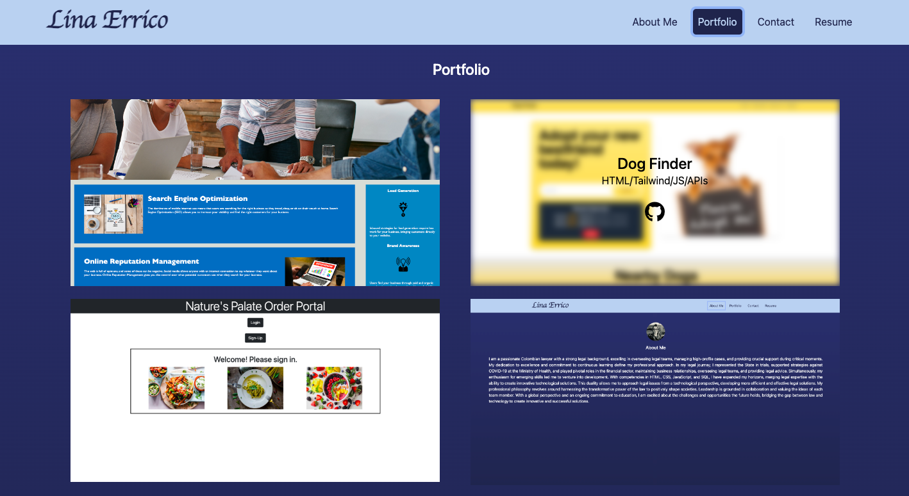
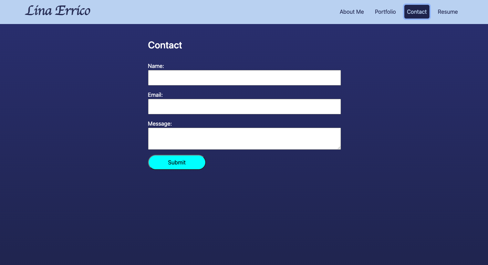
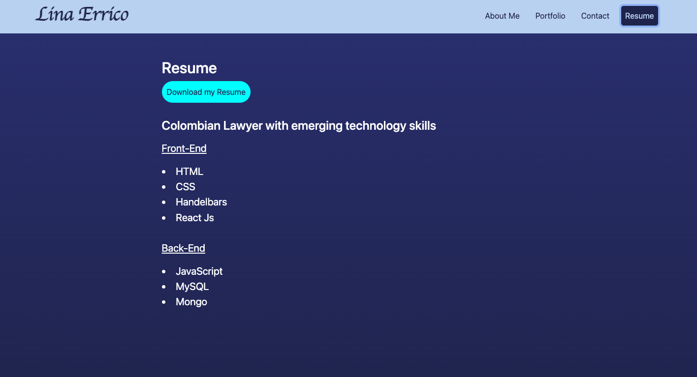

# React_Portfolio

## Description

This Portfolio was created to showcase my skills and talents to employers looking to fill a job.

The project focuses on React skills.

## Table of Contents
- [Description](#description)
- [Table of Contents](#table-of-contents)
- [Installation](#installation)
- [Usage](#usage)
- [License](#license)
- [Note](#note)

## Installation

N/A

## Usage

The URL of the functional, deployed application (Netlify) is https://react-portfolio-le.netlify.app

Place to share my projects and collaborate on future projects.

## License

## Note

This project was created based on reviewing activities from the previous classes at bootcamp and Google and ChatGPT searches.
